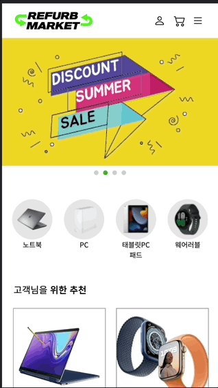
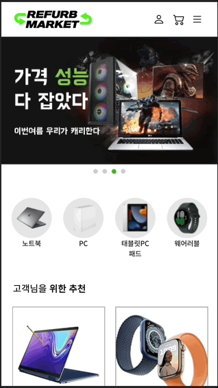
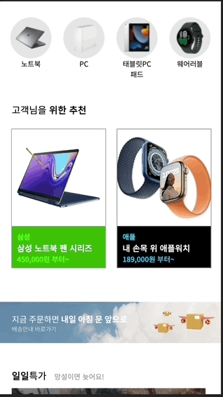
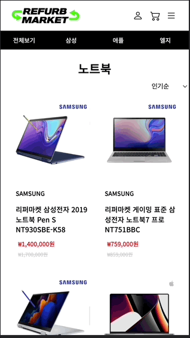

# team-refurb-market


-----------------
리퍼마켓 홈페이지를 모바일앱으로 리뉴얼하였습니다.

사이트 링크 : https://jun-isaac.github.io/refurb-market/

-----------------
## 🧑🏻‍💻 구현 목표

- [x] 자동으로 슬라이드 되는 배너
- [x] 메뉴 버튼을 누르면 옆에서 슬라이드 형태로 나오는 측면 gnb
- [x] 슬라이드 형태의 메뉴들
- [x] json으로 불려오는 제품 목록
- [x] 장바구니 모달
- [x] 구매시 모달

-----------------
## 메인프레임

* 헤더, 푸터, 토글메뉴창이 모든 페이지마다 실행되도록 함
```c
 - 헤더
  - 헤더는 로고, GNB메뉴, 토글메뉴버튼으로 구성되어 있으며 토글메뉴버튼을 누르면 토글메뉴창이 열립니다.
  - 토글메뉴버튼은 클릭시 햄버거아이콘과 닫기버튼으로 변형됩니다.
  - 토글메뉴창 안에는 로그인기능, GNB메뉴가 있습니다.
  - 로그인버튼을 누르면
```

------------------
## 메인페이지



### 움직이는 배너
- 사이트에 접속하면 상단에 보이는 배너가 우측에서 좌측으로 자동으로 넘어가고 사용자가 직접 넘길수도 있습니다.




### GNB
- GNB 메뉴가 보이지 않다가 상단에 메뉴를 누르면 옆에서 GNB가 나옵니다.





### SLIDE-MENU
- 한 화면에 들어오지 않는 메뉴들은 슬라이드 형태로 좌우 스크롤을 해서 확인이 가능합니다.

------------------



## 💻 제품 페이지

- 제품들은 전부 JSON으로 관리하여 상단에 브랜드를 누르면 그에 맞는 제품들을 목록화 해서 보여줍니다.


## 상세 페이지

- 구매하기 혹은 장바구니 버튼을 누르면 상단에서 슬라이드 형태로 modal 창이 나옵니다.

------------------
## 📕 배운 것

* 제품 관리 같은 경우는 JSON으로 목록화 해 놓는다면 유지 보수, 홈페이지 제작시에 상당히 편리하다.

* 팀플로 제작이 된 홈페이지이다 보니 따로 페이지를 만든다면 class 혹은 id 명이 겹쳐서 오류가 생길 수 있다. 팀플을 할 시에는 틀을 잡아두거나 class, id 명을 통일하는 것이 좋을듯 하다.


------------------
## 🔨 수정해야 할 것

* 우측 GNB의 경우 우측화면 밖으로 보낸다면 모바일 화면에서는 보이지 않지만 데스크탑으로 본다면 그 화면이 보입니다. 이를 개선해야 할 필요가 있습니다.

------------------

## 사용 라이브러리
|JavaScript|HTML5|CSS|jQuery|
|---|---|---|---|
